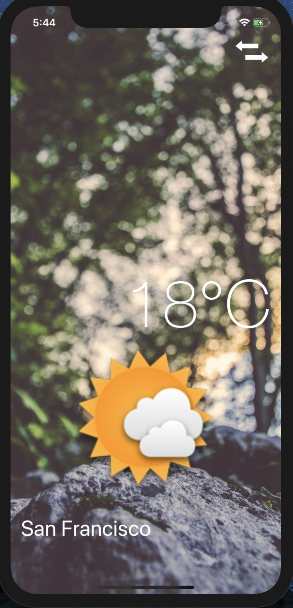
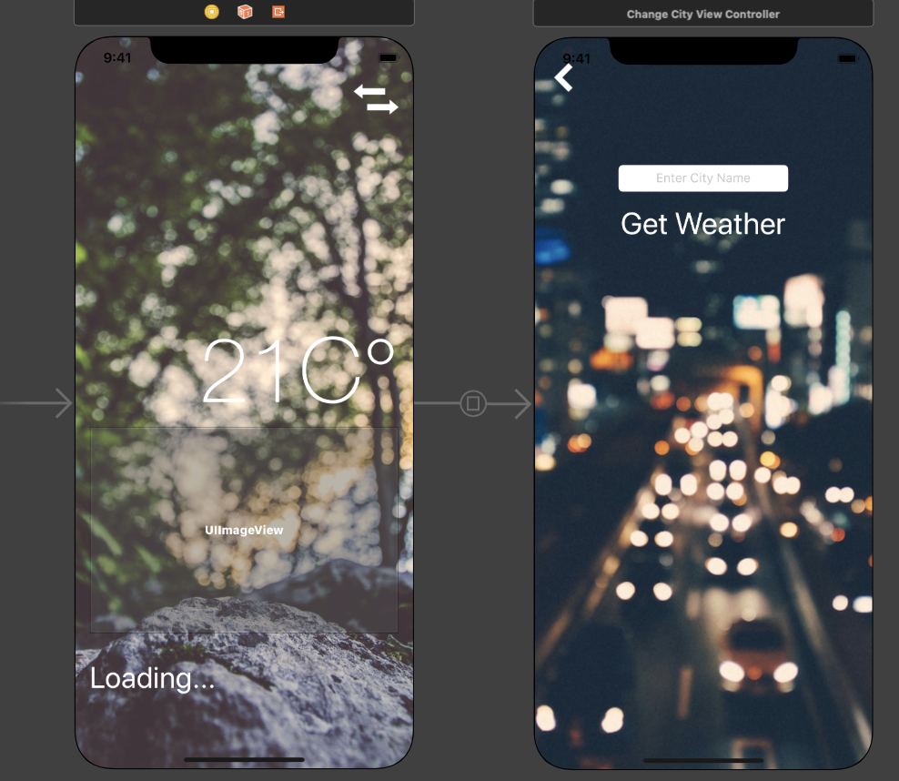

# Clima

Weather application built with IOS Swift and OpenWeather API while incorporating CocoaPods such as Alamofire, Corelocation, and SwiftyJSON. 
Users will be shown the weather of their location upon app opening and can search for weather in other cities. 



# Getting Started 

After app is loaded the page will ask the user for access to their location and use that lat and long location to show the current weather. User's can click on the top right button to change the location by typing in the name of another location and the API will get the weather for that location and display it. The weather icons will changed based on the weather happening in the location. 

# Built With 

- Swift 
- UiKit
- CocoaPods
    - Corelocation
    - SwiftyJSON
    - Alamofire 

# App Icon Logo


# Wireframe Layout

Storyboard for the project below 



# Code-Snippets

The function below shows how Alamofire is used to send a request to the openweather API and using a GET request to get a response back. Similar to a Axios or Jquery request; I put in the url and the method I need to get info and set up the response type I want to get to use for setting up the icon and displaying the temperature for the user. 
```
Alamofire.request(url, method: .get, parameters: parameters).responseJSON {
    response in
    if response.result.isSuccess {
        print("Success Got the Weather Data")
        
        let weatherJSON : JSON = JSON(response.result.value!)
        
        self.updateWeatherData(json: weatherJSON)
        
    }
    else
    {
        print("Error \(response.result.error)")
        self.cityLabel.text = "Connection Issues"
    }
}
```

# Author
* **Muhammad** - https://github.com/mawais54013